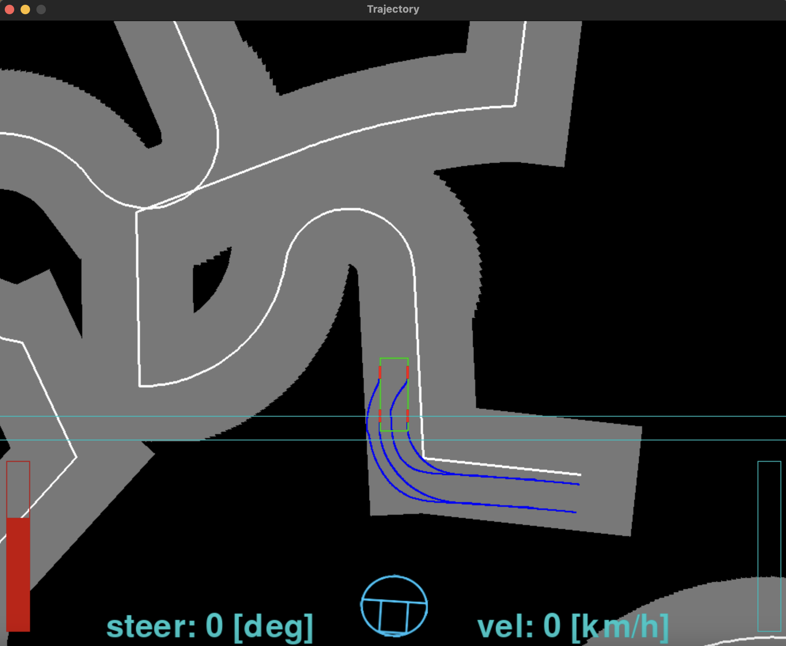

使い方
- center_attachの切り替えにより、視点を道路固定にするか車両固定にするか選べるよ
- draw_road()に色々な経路を合体・自作して代入すると色々な道が楽しめるよ
- draw_road()は経路全体を折線を中心とした四角形の集合として描画するよ
- draw_road()のnumは1か2だよ 2の場合は中央線が書かれるよ
- マウスポインタの上下方向位置がアクセル・ブレーキに対応
- 左下の赤いバーがブレーキ　右下青いバーがアクセル
- Wがドライブギア、Sがバックギア

- 画面例

- pygameライブラリに依存してます